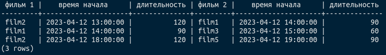
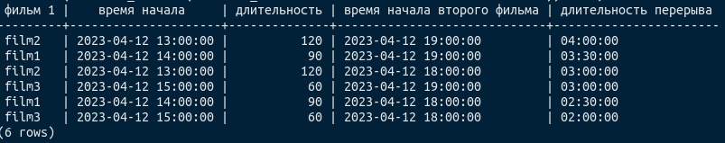
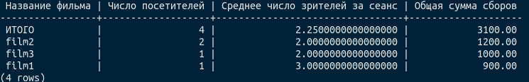
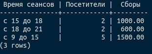

## Сделать запросы, считающие и выводящие в понятном виде:

1. ошибки в расписании (фильмы накладываются друг на друга), отсортированные по возрастанию времени. Выводить надо
   колонки:

- «фильм 1»,
- «время начала»,
- «длительность»,
- «фильм 2»,
- «время начала»,
- «длительность»;
```sql
select m1.title as "фильм 1",
       s1.start_time as "время начала",
       m1.duration as "длительность",
       m2.title as "фильм 2",
       s2.start_time as "время начала",
       m2.duration as "длительность"
from showtimes s1
         join movies m1 on s1.movie_id = m1.id
         join showtimes s2 on s1.start_time < s2.start_time
    and s1.start_time + INTERVAL '1 minute' * m1.duration > s2.start_time
         join movies m2 on s2.movie_id = m2.id
where s1.id != s2.id
order by s1.start_time ASC;
```


----------------------------------------------------------------
2. перерывы 30 минут и более между фильмами — выводить по уменьшению длительности перерыва. Колонки:

- «фильм 1»,
- «время начала»,
- «длительность»,
- «время начала второго фильма»,
- «длительность перерыва»;

```sql
SELECT m1.title AS "фильм 1",
       s1.start_time AS "время начала",
       m1.duration AS "длительность",
       s2.start_time AS "время начала второго фильма",
       (s2.start_time - (s1.start_time + INTERVAL '1 MINUTE' * m1.duration)) AS "длительность перерыва"
FROM showtimes s1
         JOIN movies m1 ON s1.movie_id = m1.id
         JOIN showtimes s2 ON s1.start_time < s2.start_time
    AND s2.start_time - INTERVAL '30 MINUTE' >= s1.start_time + INTERVAL '1 MINUTE' * m1.duration
         JOIN movies m2 ON s2.movie_id = m2.id
ORDER BY (s2.start_time - (s1.start_time + INTERVAL '1 MINUTE' * m1.duration)) DESC;
```

        
----------------------------------------------------------------
3. список фильмов, для каждого — с указанием общего числа посетителей за все время, среднего числа зрителей за сеанс и
   общей суммы сборов по каждому фильму (отсортировать по убыванию прибыли). Внизу таблицы должна быть строчка «итого»,
   содержащая данные по всем фильмам сразу;

```sql
SELECT COALESCE(m.title, 'ИТОГО')    as "Название фильма",
       COUNT(*)                      as "Число посетителей",
       AVG(t.num_visitors)           as "Среднее число зрителей за сеанс",
       SUM(s.price * t.num_visitors) as "Общая сумма сборов"
FROM Showtimes s
         JOIN Movies m ON s.movie_id = m.id
         JOIN (SELECT showtime_id, COUNT(*) AS num_visitors
               FROM Tickets
               GROUP BY showtime_id) t ON s.id = t.showtime_id
GROUP BY ROLLUP (m.title)
ORDER BY SUM(s.price * t.num_visitors) DESC;
```

        
----------------------------------------------------------------
4. число посетителей и кассовые сборы, сгруппированные по времени начала фильма: с 9 до 15, с 15 до 18, с 18 до 21, с 21
   до 00:00 (сколько посетителей пришло с 9 до 15 часов и т.д.).

```sql
SELECT CASE
           WHEN EXTRACT(HOUR FROM s.start_time) >= 9 AND EXTRACT(HOUR FROM s.start_time) < 15 THEN 'с 9 до 15'
           WHEN EXTRACT(HOUR FROM s.start_time) >= 15 AND EXTRACT(HOUR FROM s.start_time) < 18 THEN 'с 15 до 18'
           WHEN EXTRACT(HOUR FROM s.start_time) >= 18 AND EXTRACT(HOUR FROM s.start_time) < 21 THEN 'с 18 до 21'
           ELSE 'с 21 до 00 :00'
           END AS "Время сеансов",
       COUNT(DISTINCT t.id) AS "Посетители",
       SUM(s.price) AS "Сборы"
FROM movies m
         JOIN showtimes s ON m.id = s.movie_id
         JOIN tickets t ON s.id = t.showtime_id
GROUP BY "Время сеансов";
```

        